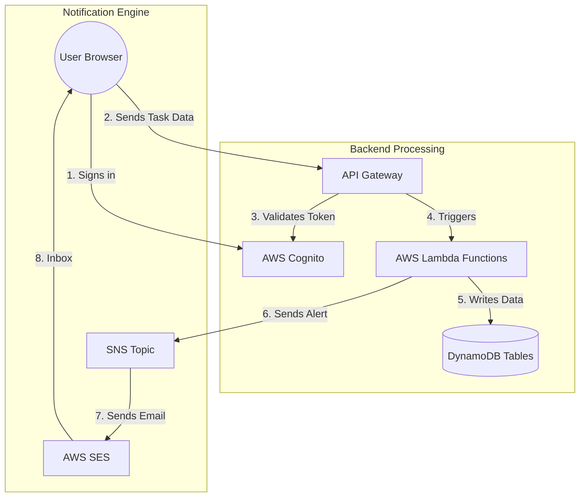

# Serverless System Architecture & Inspection Guide

This guide provides a comprehensive "eiii"-level deep dive into the **Serverless Task Management System**. It explains not just *where* the files are, but *why* they exist and how they perfectly sync up to create a production-grade application.

---

## 🏛 The Architectural Philosophy: "Why Serverless?"

This system is built using a **Serverless-First** approach. Here is why:

1.  **Zero Maintenance**: You don't manage servers. AWS handles patching, scaling, and availability.
2.  **Scale to Zero**: If no one uses the app, you pay almost nothing. If 10,000 people sign up tomorrow, AWS Lambda automatically creates more "instances" of your code to handle the load.
3.  **Security by Design**: Every component (API, Lambda, Database) is locked behind IAM (Identity and Access Management) and Cognito.

---

## 🏗 Detailed System Flow



---

## 🔐 Security & "The Gatekeepers"

How do we ensure only you (The Admin) can create tasks?

### 1. The Pre-Signup Gatekeeper (`lambda/pre-signup/src/index.js`)
Even before a user is allowed into your system, this Lambda function runs.
*   **Logic**: It checks the `email` attribute. If it's not from `@amalitech.com` or `@amalitechtraining.org`, it throws an error.
*   **Result**: No random person from the internet can even verify their email.

### 2. The API Gatekeeper (Cognito Authorizer)
Defined in `terraform/modules/api-gateway/main.tf`.
*   **Mechanism**: API Gateway requires a "JWT Token" in the header of every request.
*   **Logic**: It calls Cognito to ask: "Is this token valid and not expired?"
*   **Result**: If the user isn't logged in, they get a `401 Unauthorized` before the Lambda even sees the request.

---

## 📂 Project Connection Map: "Connecting the Dots"

### 🌉 The Bridge: Terraform to Frontend
How does the React app know where the API is?
1.  **Terraform (`terraform/outputs.tf`)** calculate the dynamic URL of the API.
2.  **Deployment Script (`deploy.sh`)** extracts these values and writes them to `frontend/.env`.
3.  **React (`frontend/src/aws-config.ts`)** reads these environment variables and provides them to the `Amplify.configure()` call in `App.tsx`.

### 📜 The Command Center: Lambda to DynamoDB
*   **Permissions**: `terraform/modules/iam/main.tf` creates a policy that says: "The function named 'create-task' is allowed to perform `PutItem` on the table named 'tasks'."
*   **Code**: `lambda/create-task/src/index.js` uses the standard AWS SDK to send the data. It receives the table name via an **Environment Variable** set by Terraform.

---

## 🗄 The Data Schema (NoSQL)

### Table: `task-management-tasks-dev`
| Attribute | Type | Description |
|-----------|------|-------------|
| `taskId` | String (PK) | Unique UUID for the task. |
| `title` | String | User-provided title. |
| `status` | String | `open`, `in_progress`, or `completed`. |
| `priority`| String | `low`, `medium`, or `high`. |
| `createdAt`| String | ISO timestamp. |

### Table: `task-management-assignments-dev`
| Attribute | Type | Description |
|-----------|------|-------------|
| `taskId` | String (PK) | Links to the task. |
| `userEmail`| String (SK) | The email of the assigned user. |

---

## 🛠 Advanced Admin Troubleshooting (The "Fix-It" Guide)

### Scenario A: "Notifications aren't arriving"
1.  **Check SNS**: In the AWS Console, look for the SNS Topic `task-management-notifications-dev`.
2.  **Check SES**: Ensure your `admin_email` is verified in SES.
3.  **Check Logs**: Tailing the Lambda logs (see below) will show if there was a "Permission Denied" error when trying to publish to SNS.

### Scenario B: "I can't see the 'Create Task' button"
1.  **Check Cognito**: Verify your user is in the `Admins` group.
    ```bash
    aws cognito-idp admin-list-groups-for-user --user-pool-id eu-west-1_o9ABTjh4f --username <YOUR_EMAIL>
    ```
2.  **Check Frontend**: Ensure `AuthContext.tsx` is correctly parsing the `cognito:groups` claim from the JWT token.

---

## 📊 Live Monitoring (Admin Terminal)

**Tail the "Heartbeat" of your app:**
```bash
# Watch the 'Assign Task' function live to see assignments happen in real-time
aws logs tail /aws/lambda/task-management-assign-task-dev --follow
```

**Check Database Health:**
```bash
# Count how many tasks are currently in the system
aws dynamodb scan --table-name task-management-tasks-dev --select "COUNT" --region eu-west-1
```

---

## 🌐 Quick Access Links
*   **Frontend**: [https://main.d276vsrnja9qba.amplifyapp.com](https://main.d276vsrnja9qba.amplifyapp.com)
*   **API**: `https://fsqxtvlqqh.execute-api.eu-west-1.amazonaws.com/dev`
*   **Region**: `eu-west-1` (Ireland)
